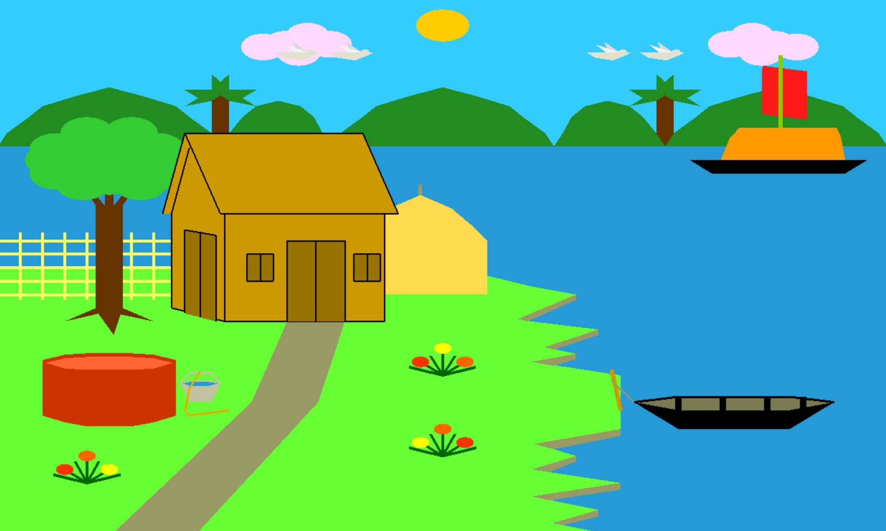
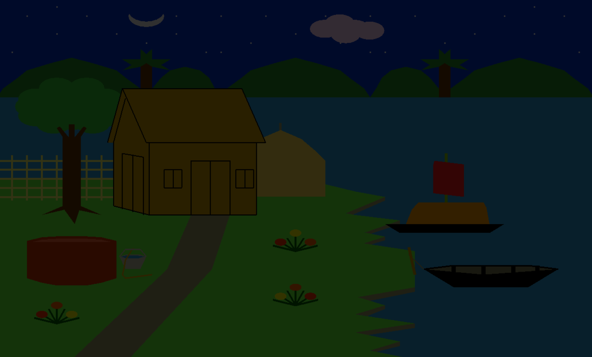
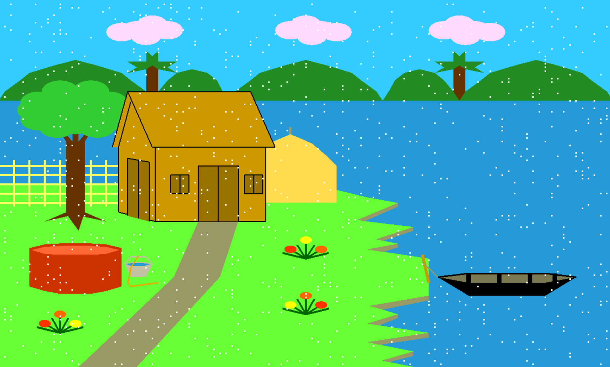
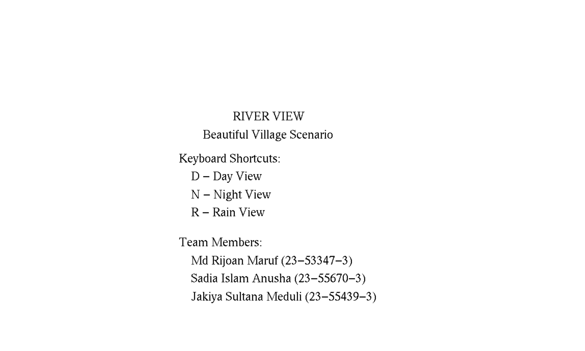

# River View - Beautiful Village Scenario

A stunning OpenGL-based graphics project showcasing a beautiful riverside village scene with dynamic weather conditions and animated elements. Experience the serene beauty of nature through day, night, and rain views with realistic animations and ambient sounds.


## 📋 Table of Contents

- [Overview](#overview)
- [Features](#features)
- [Team Members](#team-members)
- [Prerequisites](#prerequisites)
- [Installation](#installation)
- [How to Run](#how-to-run)
- [Controls](#controls)
- [Project Structure](#project-structure)
- [Technical Details](#technical-details)
- [Screenshots](#screenshots)
- [Future Enhancements](#future-enhancements)
- [License](#license)

## 🌟 Overview

River View is an interactive computer graphics project that simulates a peaceful village scenario near a river. The project demonstrates various OpenGL rendering techniques, animations, and user interactions to create an immersive visual experience. Users can switch between different environmental conditions to see how the village transforms throughout the day and during different weather patterns.

## ✨ Features

### Visual Elements
- **Detailed Village Scene**
  - Traditional huts with doors and windows
  - Trees and palm trees
  - Green grass patches
  - Village well
  - Wooden fence
  - Pathway through the village
  - Haystack/straw storage

### River & Water Features
- **Animated River**
  - Flowing blue water
  - Multiple boats (static and animated)
  - Realistic water colors

### Sky & Weather
- **Dynamic Sky**
  - Day sky (bright blue)
  - Night sky (dark blue with stars)
  - Animated clouds
  - Sun and moon with realistic positioning

### Animations
- **Moving Elements**
  - Animated clouds drifting across the sky
  - Flying birds in formation
  - Sailing boat on the river
  - Rain effect with falling droplets
  - Sun/moon movement

### Multiple View Modes
1. **Day View**
   - Bright sunny sky
   - Yellow sun
   - Flying birds
   - Green landscape
   - Ambient bird sounds

2. **Night View**
   - Dark blue sky
   - Crescent moon
   - Twinkling stars
   - Shadowed landscape
   - Cricket sounds

3. **Rain View**
   - Overcast sky
   - Animated rain droplets
   - Same village elements
   - Rain sound effects

### Audio Integration
- Realistic sound effects for each environment
- Bird chirping in day view
- Cricket sounds at night
- Rain sounds during rainy weather

## 👥 Team Members

This project was developed by:

- **Md Rijoan Maruf** (23-53347-3)
- **Sadia Islam Anusha** (23-55670-3)
- **Jakiya Sultana Meduli** (23-55439-3)

## 🔧 Prerequisites

To compile and run this project, you need:

### Required Software
- **C++ Compiler**
  - MinGW-w64 (for Windows)
  - GCC/G++ (version 7.0 or higher)
  
### Required Libraries
- **OpenGL** - Graphics rendering
- **GLUT (FreeGLUT)** - Window management and utilities
- **Windows Multimedia API** - Sound playback
  - `winmm.lib` (Windows only)

### System Requirements
- **Operating System**: Windows 7/8/10/11
- **RAM**: Minimum 2GB
- **Graphics**: OpenGL 2.0+ compatible graphics card
- **Disk Space**: ~10MB

## 📥 Installation

### Step 1: Install MinGW-w64
1. Download MinGW-w64 from [mingw-w64.org](https://www.mingw-w64.org/)
2. Install and add to system PATH

### Step 2: Install FreeGLUT
1. Download FreeGLUT from [freeglut.sourceforge.net](http://freeglut.sourceforge.net/)
2. Extract and copy files:
   - Copy `include/GL/` to `C:/MinGW/include/`
   - Copy `lib/` files to `C:/MinGW/lib/`
   - Copy `bin/` DLLs to your project directory or system32

### Step 3: Clone the Repository
```bash
git clone <repository-url>
cd Graphics
```

### Step 4: Verify Audio Files
Ensure these sound files are in the project directory:
- `bird-2.wav` - For day view
- `cricket-2.wav` - For night view
- `rain-07.wav` - For rain view

## 🚀 How to Run

### Method 1: Using Command Line

```bash
# Compile the project
g++ main.cpp -o river_view.exe -lopengl32 -lglu32 -lfreeglut -lwinmm

# Run the executable
./river_view.exe
```

### Method 2: Using Code::Blocks or Dev-C++
1. Open the project in your IDE
2. Configure linker settings to include:
   - `-lopengl32`
   - `-lglu32`
   - `-lfreeglut`
   - `-lwinmm`
3. Build and run the project

### Method 3: Using Visual Studio
1. Create a new C++ Console Application
2. Add `main.cpp` to the project
3. Configure project properties:
   - Add OpenGL and GLUT include directories
   - Link against: `opengl32.lib`, `glu32.lib`, `freeglut.lib`, `winmm.lib`
4. Build and run (Ctrl + F5)

## 🎮 Controls

### Keyboard Shortcuts

| Key | Action | Description |
|-----|--------|-------------|
| **D** or **d** | Day View | Switch to sunny day scene with birds |
| **N** or **n** | Night View | Switch to night scene with moon and stars |
| **R** or **r** | Rain View | Switch to rainy scene with falling rain |

### On Startup
- The program automatically displays an **intro screen** with:
  - Project title: "RIVER VIEW"
  - Subtitle: "Beautiful Village Scenario"
  - List of keyboard shortcuts
  - Team member information
- Press any of the view keys (D/N/R) to start


## 🔬 Technical Details

### Graphics Pipeline
- **Rendering Mode**: OpenGL Immediate Mode (Legacy)
- **Projection**: Orthographic 2D projection
- **Color Format**: RGB using `glColor3ub()`
- **Primitives Used**:
  - `GL_QUADS` - For sky, ground, structures
  - `GL_POLYGON` - For complex shapes
  - `GL_TRIANGLE_FAN` - For circles (sun, moon, clouds)
  - `GL_LINES` - For outlines and details
  - `GL_POINTS` - For stars and rain

### Animation System
- **Timer-based animations** using `glutTimerFunc()`
- **Frame rate**: ~10 FPS (100ms intervals)
- **Animated elements**:
  - Clouds: Horizontal movement with wrapping
  - Birds: Horizontal flight animation
  - Boat: River navigation
  - Rain: Vertical falling effect
  - Sun: Gradual movement

### Key Functions

#### Scene Drawing Functions
- `sky()` / `sky2()` - Day/night sky backgrounds
- `sun()` / `moon()` - Celestial bodies
- `cloud1()`, `cloud2()`, `cloud3()` - Cloud formations
- `river()` - Water body
- `ground()` - Terrain
- `hut()` / `hut1()` - Village structures
- `tree()` - Detailed tree rendering
- `backgroundtree()` - Background vegetation
- `bird()` - Flying birds
- `stars()` - Night stars
- `boat()`, `boat2()`, `boat3()`, `boat4()` - Various boat types
- `fence()` - Village fence
- `grass1()` through `grass6()` - Grass patches
- `well()` / `well1()` - Village well
- `Straw()` - Haystack
- `way()` - Pathway

#### Display Functions
- `display()` - Day view rendering
- `display1()` - Rain view rendering
- `display2()` - Night view rendering
- `Display()` - Intro screen
- `StartingText()` - Welcome text overlay

#### Animation Callbacks
- `cloud(int value)` - Cloud movement timer
- `birdd(int value)` - Bird animation timer
- `boat(int value)` - Boat movement timer
- `rain(int value)` - Rain effect timer
- `sunn(int value)` - Sun movement timer

#### Utility Functions
- `init()` - OpenGL initialization
- `reshape()` - Window reshape handler
- `handleKeypress()` - Keyboard input handler
- `PointLight()` - Lighting setup
- `DrawSphere()` - 3D sphere rendering

### Code Organization
- **Global Variables**: Position and speed for animations
- **Constants**: PI defined for circle calculations
- **Colors**: RGB values for realistic rendering
- **Modular Design**: Each scene element in separate function

## 📸 Screenshots


### Day View

*Bright sunny day with birds flying over the village*

### Night View

*Peaceful night with moon and stars*

### Rain View

*Rainy weather with falling droplets*

### Intro Screen

*Welcome screen with project information*

## 🚧 Future Enhancements

Potential improvements for the project:

- [ ] Add more animated elements (fish in river, smoke from hut)
- [ ] Implement smooth transitions between views
- [ ] Add more weather conditions (snow, fog)
- [ ] Include interactive elements (clickable objects)
- [ ] Enhance lighting effects (shadows, reflections)
- [ ] Add more sound effects (water flowing, wind)
- [ ] Implement 3D perspective view option
- [ ] Add seasonal variations
- [ ] Create configuration file for customization
- [ ] Add pause/resume functionality

## 🎓 Learning Outcomes

This project demonstrates:
- OpenGL fundamentals and 2D graphics rendering
- Animation techniques using timers
- User input handling
- Modular programming practices
- Scene composition and layering
- Audio integration in graphics applications
- Color theory and visual design
- Event-driven programming

## 🐛 Known Issues

- Sound files must be in the same directory as executable
- Window resizing may distort the scene
- Animation speeds are hardware-dependent

## 🤝 Contributing

This is an academic project. If you'd like to contribute:
1. Fork the repository
2. Create a feature branch
3. Commit your changes
4. Push to the branch
5. Open a Pull Request


